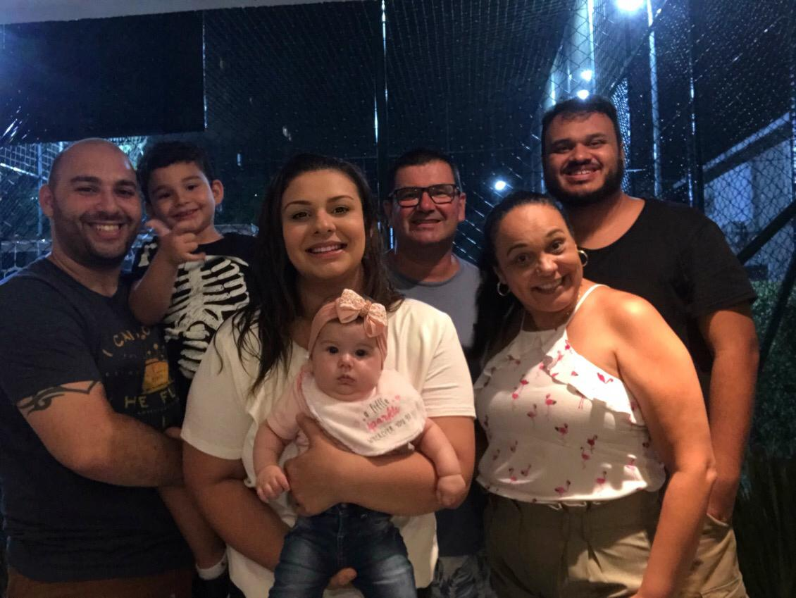

Far far away, in a city from **Brazil**. In a simple family born a weak baby, two young parents start this family. My first memories are about my father to build own first house after a long day working how aircraft mechanical and my mother made bread and chocolate to improve financial balance. That was the reality from **Brazil** in the 90's, work all day without knowing anything about the future. 

My parents give me an Atari 2600, my first videogame. I was a smart boy, always learning about science and the best from the class. But I'm a lazy person, sometimes I lost my time trying to discover how don't do one thing and it easier only to do. But my father teaches me a lesson at this moment, the world doesn't care what you think about yourself. At 15y old my parents give me my first computer, an old *PC Pentium 133* with a *16MB* ram. *Windows 98 and a magic DOS.*

With a young sister, now my family did the last sacrifice to me and pay a programming course in **PASCAL** and **VB 6.0** and I did a course to be an electrician ( with a very small salary and free tuition). After 2 years, I remember one day when I'm very hungry and I think: 

> Why? Why so hard? I'm 16y old. 

But in this electrician course, I know other young with more hard lives and I remember my father: the world doesn't care. 

I started college and to work to pay the tuition. The First 2 years were amazing, I learned **C/C++**, **PHP**, **JAVA** and started in the new concept migrate the old desktops systems to WEB. Migrate my life to Linux and the new revolution: Free software and Open Source. But after all this work, I lost to depression. In a moment, I lost all motivation. No more passion for code.

> At this moment, my parents saved me more one time. 

Next 7 years, I am dedicated to learning and grow my career. I had success without thing much about other people. I'm not a bad person but I didn't care about others. Racism and bias were common to me but I didn't have time to think about this, only work and career objective. Hard Skills and soft skills, networking. Married. New house. Financial problems. A sad guy but with a fake smile. 

But in a moment, I accepted a proposal to work in a small startup with a suspect office and an exotic team. I, a very corporative developer, in a crazy startup with a dream to change the marketplace for rent apartments. I worked with the best developers, but in this company, I found awesome people. They taught me how I can be more of a coder, be human. 

After a period of 9 months, I change all my life. Then two years, divorced I working at **IBM**. I resolved to move from another country: **Portugal**. 

Now in Lisbon, I'm a very different person. More patient and focus, here I found the balance and now I have more passion for code. 

Here small part from Emicida song: Ooorra
```
I called some brother when we were a business partner 
I thought I made friends, and I was doing business 
I hate to sell something that is so mine 
But if someone is going to make money with this shit, then let it be me 
And the ones who don't want money, bro, because they never saw 
The belly growl louder than I love you
```

Now, I'm living alone here in this country. An amazing country. I did new friends here. And this my diary to write about code and my boring life. 

[^1]

[^1]: It's image is pre-pandemic and pre-diet :). 

